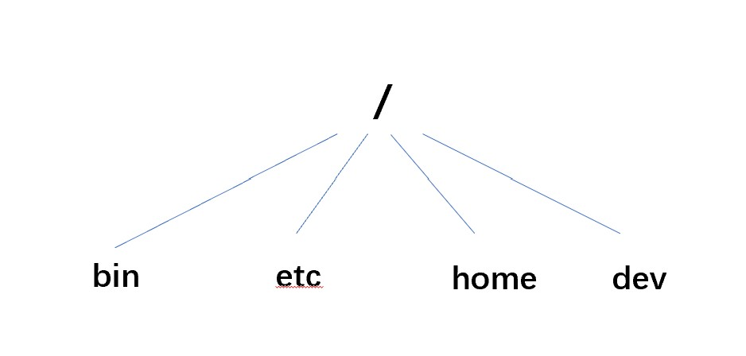

# UnixFileSystem
Using `cpp` to simulate the file system of Unix

## Overview

This is my curriculum design of *Operate System*, a part of the source code is from UNIX V6++

* Develop Environment: Ubuntu 18.04.2 LTS on Windows 10 x86_64
* Contribute a simple file system includes FS structure and basic FS operations
* Using a IMG file to imitate the hard driver
* Code for Learning

## Guide

This project mainly has two executable program:

* `format`

  Please use this to format `myDisk.img` into UNIX V6++ Volume:

  * Super Block

  * Data Bitmap

  * Inode Bitmap

  * Inode Space

  * Data Space

    | Super Block | Data Bitmap | Inode Bitmap | Inode Space                    | Data Space    |
    | ----------- | ----------- | ------------ | ------------------------------ | ------------- |
    | Block 0     | Block 1     | Block 2      | Block 3 ~ (Dynamic allocation) | < (4M ~ 128M) |

  **some details**

  * Block Size: 4096 Bytes
  * Data Bitmap: 1 Block → 4 * 1024 * 8 Blocks → 128 MB，so this FS contains 128MB space at **Most**
  * Inode Bitmap: 1 Block → 4 * 1024 * 8 Inodes
  * Inode Space: 1 Block contains 64 Inodes and every 4 Blocks will allocate a Inode, so every megabyte of data will allocate a block of Inodes
  * Data Space: Rest of the Space 
  * Disk Size: 4096 Blocks (16M) at **Least** and 134217728 Blocks (128M) at **Most**

  

  **then**

  After format `myDisk.img`，it will contain a root directory and four sub directory

  * bin
  * etc
  * home
  * dev

  

* `secondFS`

  This is basic command prompt window

  Basic system instructions:

  * creat
  * open
  * read
  * write
  * lseek(seek)
  * close
  * mkdir
  * others...
